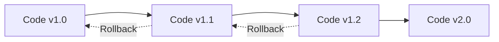
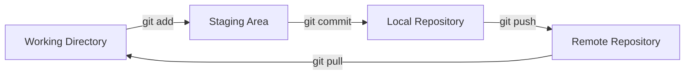
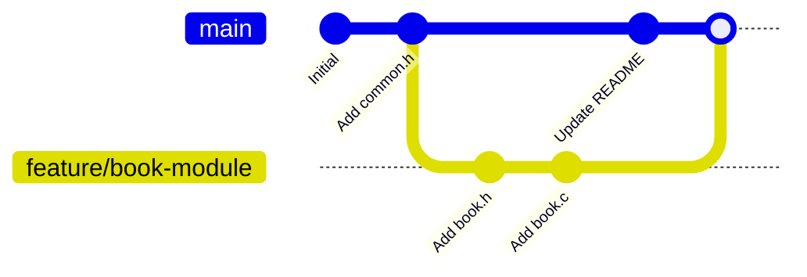
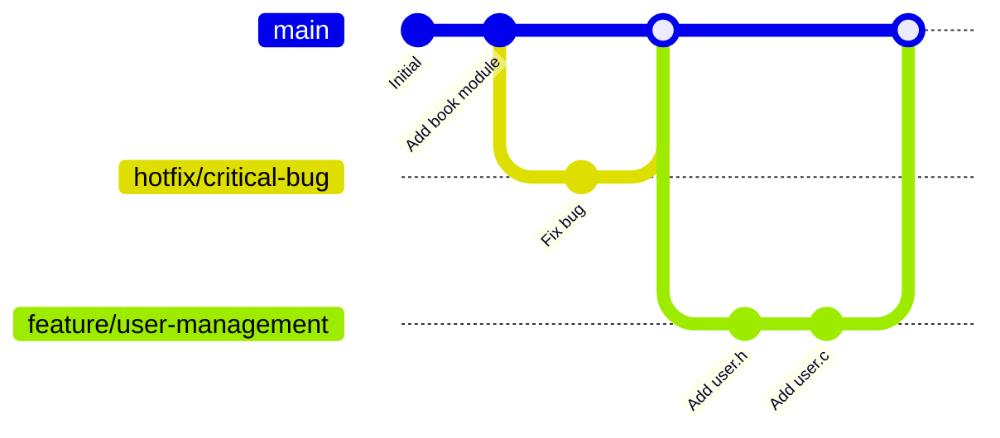
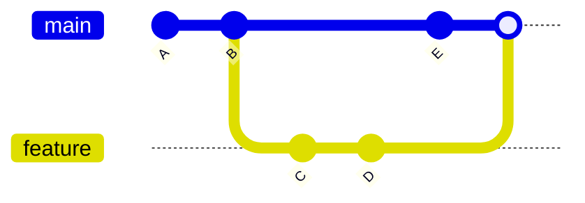
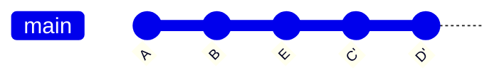

# Git Master Guide - Từ Zero Đến Hero 🚀

> **Mục tiêu**: Sau khi đọc xong tài liệu này, bạn sẽ hiểu sâu về Git và có thể sử dụng thành thạo trong mọi dự án.

---

## 📚 Mục Lục

1. [Git Là Gì?](#git-là-gì)
2. [Cài Đặt và Cấu Hình](#cài-đặt-và-cấu-hình)
3. [Khái Niệm Cơ Bản](#khái-niệm-cơ-bản)
4. [Workflow Cơ Bản](#workflow-cơ-bản)
5. [File .gitignore Chi Tiết](#file-gitignore-chi-tiết)
6. [Kết Nối Với GitHub](#kết-nối-với-github)
7. [Branching và Merging](#branching-và-merging)
8. [Các Lệnh Git Nâng Cao](#các-lệnh-git-nâng-cao)
9. [Xử Lý Lỗi Thường Gặp](#xử-lý-lỗi-thường-gặp)
10. [Best Practices](#best-practices)

---

## 1. Git Là Gì?

### Định Nghĩa

**Git** là một **hệ thống quản lý phiên bản phân tán** (Distributed Version Control System - DVCS).

### Tại Sao Cần Git?



**Lợi ích:**
- ✅ Theo dõi lịch sử thay đổi code
- ✅ Quay lại phiên bản cũ khi cần
- ✅ Làm việc nhóm hiệu quả
- ✅ Backup code tự động
- ✅ Thử nghiệm tính năng mới mà không ảnh hưởng code chính

### Git vs GitHub

| Git | GitHub |
|-----|--------|
| Phần mềm quản lý version | Website lưu trữ code |
| Chạy trên máy local | Chạy trên cloud |
| Miễn phí, open-source | Có free và paid plans |
| Không cần internet | Cần internet |

**Ví dụ tương tự:**
- Git = Microsoft Word (phần mềm)
- GitHub = Google Drive (nơi lưu trữ)

---

## 2. Cài Đặt và Cấu Hình

### 2.1. Kiểm Tra Git Đã Cài Chưa

```bash
git --version
```

**Output mong đợi:**
```
git version 2.34.1
```

**Giải thích:**
- Lệnh này kiểm tra xem Git đã được cài đặt chưa
- Nếu có, sẽ hiển thị phiên bản
- Nếu chưa có, sẽ báo lỗi `command not found`

### 2.2. Cài Đặt Git (Nếu Chưa Có)

**Ubuntu/Debian:**
```bash
sudo apt update
sudo apt install git
```

**Giải thích:**
- `sudo` - Chạy với quyền admin
- `apt update` - Cập nhật danh sách package
- `apt install git` - Cài đặt Git

### 2.3. Cấu Hình Thông Tin Cá Nhân

```bash
git config --global user.name "Ngo Minh Tri"
git config --global user.email "ngominhtri151002@gmail.com"
```

**Giải thích từng phần:**

| Phần | Ý Nghĩa |
|------|---------|
| `git config` | Lệnh cấu hình Git |
| `--global` | Áp dụng cho TẤT CẢ repo trên máy |
| `user.name` | Tên hiển thị trong commit |
| `user.email` | Email hiển thị trong commit |

**Tại sao cần cấu hình này?**
- Mỗi commit sẽ ghi lại ai đã thực hiện
- GitHub dùng email để liên kết commit với tài khoản

**Kiểm tra cấu hình:**
```bash
git config --list
```

**Hoặc xem từng giá trị:**
```bash
git config user.name
git config user.email
```

### 2.4. Cấu Hình Editor Mặc Định (Optional)

```bash
git config --global core.editor "nano"
# Hoặc
git config --global core.editor "vim"
# Hoặc
git config --global core.editor "code --wait"  # VSCode
```

**Giải thích:**
- Khi Git cần bạn nhập message (VD: merge commit), nó sẽ mở editor này
- `--wait` (VSCode): Git đợi bạn đóng editor mới tiếp tục

---

## 3. Khái Niệm Cơ Bản

### 3.1. Repository (Repo)

**Định nghĩa:** Thư mục chứa code và lịch sử thay đổi của dự án.

**Có 2 loại:**
- **Local Repository**: Trên máy tính của bạn
- **Remote Repository**: Trên server (GitHub, GitLab...)

### 3.2. Ba Vùng Làm Việc Của Git



#### Working Directory (Thư mục làm việc)
- Nơi bạn chỉnh sửa code
- File ở đây chưa được Git theo dõi

#### Staging Area (Vùng chuẩn bị)
- Nơi chứa các thay đổi chuẩn bị commit
- Dùng `git add` để đưa file vào đây

#### Local Repository (Kho local)
- Lưu trữ lịch sử commit trên máy
- Dùng `git commit` để lưu vào đây

#### Remote Repository (Kho remote)
- Lưu trữ trên server (GitHub)
- Dùng `git push` để đẩy code lên

### 3.3. Commit

**Định nghĩa:** Một "snapshot" (ảnh chụp) của code tại một thời điểm.

**Mỗi commit có:**
- **Hash** (ID duy nhất): `a3f5b2c...`
- **Author**: Người tạo commit
- **Date**: Thời gian tạo
- **Message**: Mô tả thay đổi
- **Changes**: Những file đã thay đổi

**Ví dụ:**
```
commit a3f5b2c1d4e6f7g8h9i0j1k2l3m4n5o6p7q8r9s0
Author: Ngo Minh Tri <ngominhtri151002@gmail.com>
Date:   Fri Jan 17 18:00:00 2026 +0700

    Add book management module
```

### 3.4. Branch

**Định nghĩa:** Nhánh phát triển độc lập.



**Tại sao cần branch?**
- Phát triển tính năng mới mà không ảnh hưởng code chính
- Nhiều người làm việc song song
- Dễ dàng quay lại nếu tính năng lỗi

---

## 4. Workflow Cơ Bản

### 4.1. Khởi Tạo Repository

#### Cách 1: Tạo Repo Mới

```bash
cd /path/to/your/project
git init
```

**Giải thích:**
- `git init` - Khởi tạo Git repository
- Tạo thư mục ẩn `.git/` chứa toàn bộ lịch sử
- Sau lệnh này, Git bắt đầu theo dõi thư mục

**Kiểm tra:**
```bash
ls -la
# Sẽ thấy thư mục .git/
```

#### Cách 2: Clone Repo Có Sẵn

```bash
git clone https://github.com/username/repo-name.git
```

**Giải thích:**
- Tải toàn bộ code và lịch sử từ GitHub về máy
- Tự động tạo thư mục với tên repo
- Tự động cấu hình remote `origin`

### 4.2. Kiểm Tra Trạng Thái

```bash
git status
```

**Output mẫu:**
```
On branch main
Your branch is up to date with 'origin/main'.

Changes not staged for commit:
  (use "git add <file>..." to update what will be committed)
  (use "git restore <file>..." to discard changes in working directory)
        modified:   src/book.c

Untracked files:
  (use "git add <file>..." to include in what will be committed)
        src/user.c

no changes added to commit (use "git add" and/or "git commit -a")
```

**Giải thích từng phần:**

| Phần | Ý Nghĩa |
|------|---------|
| `On branch main` | Đang ở nhánh main |
| `Changes not staged` | File đã sửa nhưng chưa add |
| `Untracked files` | File mới, Git chưa theo dõi |
| `modified: src/book.c` | File đã tồn tại, đã sửa |
| `src/user.c` | File mới tạo |

### 4.3. Thêm File Vào Staging Area

```bash
# Add một file
git add src/book.c

# Add nhiều file
git add src/book.c include/book.h

# Add tất cả file trong thư mục
git add src/

# Add TẤT CẢ file đã thay đổi
git add .

# Add tất cả file (kể cả file đã xóa)
git add -A
```

**Giải thích chi tiết:**

| Lệnh | Tác Dụng |
|------|----------|
| `git add file.c` | Add 1 file cụ thể |
| `git add .` | Add tất cả trong thư mục hiện tại |
| `git add -A` | Add tất cả (new, modified, deleted) |
| `git add *.c` | Add tất cả file .c |

**Kiểm tra sau khi add:**
```bash
git status
```

Output:
```
Changes to be committed:
  (use "git restore --staged <file>..." to unstage)
        modified:   src/book.c
        new file:   src/user.c
```

### 4.4. Commit Thay Đổi

```bash
git commit -m "Add user management module"
```

**Giải thích:**
- `git commit` - Lưu snapshot vào repo
- `-m` - Message (mô tả ngắn gọn)
- Message nên rõ ràng, mô tả ĐIỀU GÌ đã làm

**Commit message tốt:**
```bash
git commit -m "Add book CRUD operations"
git commit -m "Fix: Handle null pointer in add_book()"
git commit -m "Refactor: Extract validation to utils.c"
```

**Commit message tệ:**
```bash
git commit -m "update"           # Quá chung chung
git commit -m "fix bug"          # Không rõ bug gì
git commit -m "asdfasdf"         # Vô nghĩa
```

**Commit với message dài:**
```bash
git commit
# Sẽ mở editor để viết message nhiều dòng
```

Format:
```
Add book management module

- Implement add_book() function
- Implement delete_book() function
- Add validation for book ID
- Update README with usage examples
```

### 4.5. Xem Lịch Sử Commit

```bash
# Xem lịch sử đầy đủ
git log

# Xem lịch sử ngắn gọn (1 dòng/commit)
git log --oneline

# Xem lịch sử với graph
git log --oneline --graph --all

# Xem 5 commit gần nhất
git log -5

# Xem commit của một file
git log src/book.c
```

**Output mẫu `git log --oneline`:**
```
a3f5b2c Add user management module
b4e6c3d Fix null pointer bug
c5f7d4e Add book CRUD operations
d6g8e5f Initial commit
```

### 4.6. Xem Thay Đổi Chi Tiết

```bash
# Xem thay đổi chưa add
git diff

# Xem thay đổi đã add (trong staging)
git diff --staged

# Xem thay đổi của một file
git diff src/book.c

# Xem thay đổi giữa 2 commit
git diff a3f5b2c b4e6c3d
```

**Output mẫu:**
```diff
diff --git a/src/book.c b/src/book.c
index 1234567..abcdefg 100644
--- a/src/book.c
+++ b/src/book.c
@@ -10,6 +10,7 @@
 int add_book(Library *lib, Book book) {
+    if (lib == NULL) return ERROR_NULL_POINTER;
     if (lib->book_count >= MAX_BOOKS) {
         return ERROR_FULL;
     }
```

**Giải thích:**
- `---` - File cũ
- `+++` - File mới
- `-` (màu đỏ) - Dòng bị xóa
- `+` (màu xanh) - Dòng được thêm

---

## 5. File .gitignore Chi Tiết

### 5.1. .gitignore Là Gì?

**Định nghĩa:** File chứa danh sách các file/thư mục mà Git sẽ **BỎ QUA**, không theo dõi.

**Tại sao cần?**
- Không commit file build (`.o`, `.exe`)
- Không commit file cấu hình cá nhân (`.vscode/`)
- Không commit file nhạy cảm (password, API key)
- Giữ repo gọn gàng

### 5.2. Cú Pháp .gitignore

#### Comment
```gitignore
# Đây là comment
# Git sẽ bỏ qua dòng này
```

#### Ignore File Cụ Thể
```gitignore
main.o           # Ignore file main.o
config.txt       # Ignore file config.txt
```

#### Ignore Tất Cả File Có Extension
```gitignore
*.o              # Ignore tất cả file .o
*.exe            # Ignore tất cả file .exe
*.log            # Ignore tất cả file .log
```

#### Ignore Thư Mục
```gitignore
obj/             # Ignore thư mục obj/ và tất cả nội dung bên trong
bin/             # Ignore thư mục bin/
node_modules/    # Ignore node_modules/ (Node.js)
```

#### Ignore Tất Cả File Trong Thư Mục
```gitignore
logs/*.log       # Ignore tất cả .log trong thư mục logs/
data/*.txt       # Ignore tất cả .txt trong thư mục data/
```

#### Ignore Đệ Quy (Tất Cả Thư Mục Con)
```gitignore
**/temp/         # Ignore thư mục temp/ ở MỌI cấp
**/*.o           # Ignore tất cả .o ở MỌI thư mục
```

#### Ngoại Lệ (Không Ignore)
```gitignore
*.log            # Ignore tất cả .log
!important.log   # NHƯNG không ignore important.log
```

#### Ignore File Trong Thư Mục Gốc
```gitignore
/TODO.txt        # Chỉ ignore TODO.txt ở thư mục gốc
                 # Không ignore src/TODO.txt
```

### 5.3. .gitignore Mẫu Cho Dự Án C

```gitignore
# ========== Build Artifacts ==========
# Object files
*.o
*.obj

# Executables
*.exe
*.out
a.out
main

# Static libraries
*.a
*.lib

# Shared libraries
*.so
*.dylib
*.dll

# Build directories
obj/
bin/
build/
dist/

# ========== Editor & IDE ==========
# VSCode
.vscode/
*.code-workspace

# Vim
*.swp
*.swo
*~
.*.swp

# Emacs
*~
\#*\#
.\#*

# JetBrains (CLion)
.idea/
*.iml
cmake-build-*/

# ========== OS Files ==========
# macOS
.DS_Store
.AppleDouble
.LSOverride

# Windows
Thumbs.db
ehthumbs.db
Desktop.ini

# Linux
*~

# ========== Project Specific ==========
# Data files (nếu không muốn commit)
data/*.txt
data/*.csv

# Log files
*.log
logs/

# Temporary files
tmp/
temp/
*.tmp

# Backup files
*.bak
*.backup

# ========== Dependencies ==========
# If using package managers
lib/
vendor/

# ========== Sensitive Information ==========
# Credentials
.env
secrets.txt
config/credentials.json

# API Keys
api_keys.txt
```

### 5.4. Cách Sử Dụng .gitignore

#### Tạo File
```bash
touch .gitignore
nano .gitignore
```

#### Thêm Nội Dung
Copy nội dung mẫu ở trên vào file.

#### Commit .gitignore
```bash
git add .gitignore
git commit -m "Add .gitignore"
```

### 5.5. Xử Lý File Đã Commit Nhưng Muốn Ignore

**Vấn đề:** Bạn đã commit `main.o`, bây giờ muốn ignore nó.

**Giải pháp:**
```bash
# Xóa file khỏi Git (nhưng GIỮ trên máy)
git rm --cached main.o

# Thêm vào .gitignore
echo "*.o" >> .gitignore

# Commit
git add .gitignore
git commit -m "Remove and ignore .o files"
```

**Giải thích:**
- `git rm --cached` - Xóa khỏi Git tracking, nhưng file vẫn còn trên máy
- `--cached` - Chỉ xóa trong Git, không xóa file thật

### 5.6. Kiểm Tra File Có Bị Ignore Không

```bash
git check-ignore -v main.o
```

**Output:**
```
.gitignore:3:*.o    main.o
```

**Giải thích:**
- `.gitignore:3` - Dòng 3 trong .gitignore
- `*.o` - Pattern match
- `main.o` - File bị ignore

### 5.7. Global .gitignore (Cho Tất Cả Repo)

```bash
# Tạo file global gitignore
touch ~/.gitignore_global

# Thêm nội dung (VD: .DS_Store, .vscode/)
nano ~/.gitignore_global

# Cấu hình Git dùng file này
git config --global core.excludesfile ~/.gitignore_global
```

**Lợi ích:**
- Không cần tạo `.gitignore` cho mỗi repo
- Ignore các file cá nhân (editor config, OS files)

---

## 6. Kết Nối Với GitHub

### 6.1. Tạo Repository Trên GitHub

**Bước 1:** Đăng nhập GitHub → Click **"+"** → **"New repository"**

**Bước 2:** Điền thông tin:
- **Repository name**: `library-management-c`
- **Description**: "Ứng dụng quản lý thư viện bằng C"
- **Public** hoặc **Private**
- **KHÔNG** tick "Initialize with README" (vì đã có code)

**Bước 3:** Click **"Create repository"**

### 6.2. Kết Nối Local Repo Với GitHub

```bash
git remote add origin https://github.com/MinnT15/library-management-c.git
```

**Giải thích từng phần:**

| Phần | Ý Nghĩa |
|------|---------|
| `git remote` | Quản lý remote repository |
| `add` | Thêm remote mới |
| `origin` | Tên remote (convention: dùng "origin") |
| `URL` | Địa chỉ repo trên GitHub |

**Kiểm tra remote:**
```bash
git remote -v
```

**Output:**
```
origin  https://github.com/MinnT15/library-management-c.git (fetch)
origin  https://github.com/MinnT15/library-management-c.git (push)
```

**Giải thích:**
- `fetch` - URL để pull code về
- `push` - URL để push code lên

### 6.3. Push Code Lên GitHub

```bash
git push -u origin main
```

**Giải thích từng phần:**

| Phần | Ý Nghĩa |
|------|---------|
| `git push` | Đẩy code lên remote |
| `-u` | Set upstream (tracking branch) |
| `origin` | Tên remote |
| `main` | Tên branch |

**Sau lần đầu, chỉ cần:**
```bash
git push
```

**Vì đã set upstream (`-u`), Git biết push lên đâu.**

### 6.4. Pull Code Từ GitHub

```bash
git pull origin main
```

**Giải thích:**
- Tải code mới nhất từ GitHub về
- Tự động merge với code local

**Hoặc:**
```bash
git pull
```
(Nếu đã set upstream)

### 6.5. Xác Thực GitHub

#### Option 1: HTTPS + Personal Access Token (Khuyến nghị)

**Bước 1:** Tạo token
1. GitHub → Settings → Developer settings
2. Personal access tokens → Tokens (classic)
3. Generate new token (classic)
4. Chọn scopes: `repo` (full control)
5. Generate token → **Copy token**

**Bước 2:** Dùng token khi push
```bash
git push
# Username: MinnT15
# Password: [paste token ở đây]
```

**Lưu token để không phải nhập lại:**
```bash
git config --global credential.helper store
git push
# Nhập token 1 lần, sau đó Git sẽ lưu
```

#### Option 2: SSH Key (Nâng cao)

**Bước 1:** Tạo SSH key
```bash
ssh-keygen -t ed25519 -C "ngominhtri151002@gmail.com"
# Enter file: [Enter] (dùng default)
# Passphrase: [Enter] (hoặc nhập password)
```

**Bước 2:** Copy public key
```bash
cat ~/.ssh/id_ed25519.pub
```

**Bước 3:** Thêm vào GitHub
1. GitHub → Settings → SSH and GPG keys
2. New SSH key
3. Paste key → Add SSH key

**Bước 4:** Đổi remote sang SSH
```bash
git remote set-url origin git@github.com:MinnT15/library-management-c.git
```

**Bước 5:** Test
```bash
ssh -T git@github.com
# Output: Hi MinnT15! You've successfully authenticated...
```

**Lợi ích SSH:**
- Không cần nhập password mỗi lần push
- An toàn hơn HTTPS

---

## 7. Branching và Merging

### 7.1. Tại Sao Cần Branch?

**Kịch bản:**
- Bạn đang code tính năng "User Management"
- Đột nhiên phát hiện bug nghiêm trọng cần fix ngay
- Nếu không dùng branch, code đang làm dở sẽ bị ảnh hưởng

**Giải pháp:**


### 7.2. Các Lệnh Branch Cơ Bản

#### Xem Danh Sách Branch
```bash
git branch
```

**Output:**
```
* main
  feature/user-management
  hotfix/bug-123
```

**Giải thích:**
- `*` - Branch hiện tại
- Các branch khác

#### Tạo Branch Mới
```bash
git branch feature/user-management
```

**Giải thích:**
- Tạo branch mới từ commit hiện tại
- Chưa chuyển sang branch mới

#### Chuyển Sang Branch Khác
```bash
git checkout feature/user-management
```

**Hoặc (Git 2.23+):**
```bash
git switch feature/user-management
```

#### Tạo Và Chuyển Ngay
```bash
git checkout -b feature/borrow-management
```

**Hoặc:**
```bash
git switch -c feature/borrow-management
```

**Giải thích:**
- `-b` / `-c` - Create (tạo mới)
- Tạo và chuyển sang branch mới luôn

#### Xóa Branch
```bash
git branch -d feature/user-management
```

**Giải thích:**
- `-d` - Delete (xóa)
- Chỉ xóa được nếu đã merge
- Dùng `-D` để force xóa

### 7.3. Merge Branch

**Kịch bản:** Bạn đã code xong tính năng ở branch `feature/user-management`, muốn merge vào `main`.

```bash
# Bước 1: Chuyển về main
git checkout main

# Bước 2: Merge feature branch vào main
git merge feature/user-management
```

**Output thành công:**
```
Updating a3f5b2c..b4e6c3d
Fast-forward
 src/user.c     | 50 ++++++++++++++++++++++++++++++++++++++++++++++++++
 include/user.h | 20 ++++++++++++++++++++
 2 files changed, 70 insertions(+)
 create mode 100644 src/user.c
 create mode 100644 include/user.h
```

### 7.4. Xử Lý Conflict

**Khi nào xảy ra conflict?**
- 2 branch sửa cùng 1 dòng code
- Git không biết giữ thay đổi nào

**Ví dụ:**

Branch `main`:
```c
printf("Hello World\n");
```

Branch `feature/greeting`:
```c
printf("Xin chào\n");
```

**Khi merge:**
```bash
git merge feature/greeting
```

**Output:**
```
Auto-merging src/main.c
CONFLICT (content): Merge conflict in src/main.c
Automatic merge failed; fix conflicts and then commit the result.
```

**File `src/main.c` sẽ có:**
```c
<<<<<<< HEAD
printf("Hello World\n");
=======
printf("Xin chào\n");
>>>>>>> feature/greeting
```

**Giải thích:**
- `<<<<<<< HEAD` - Code ở branch hiện tại (main)
- `=======` - Phân cách
- `>>>>>>> feature/greeting` - Code từ branch merge vào

**Cách xử lý:**

**Bước 1:** Sửa file, chọn code muốn giữ
```c
printf("Xin chào\n");  // Chọn giữ code này
```

**Bước 2:** Xóa các dòng conflict marker
```c
// Xóa: <<<<<<< HEAD
// Xóa: =======
// Xóa: >>>>>>> feature/greeting
```

**Bước 3:** Add và commit
```bash
git add src/main.c
git commit -m "Merge feature/greeting: Resolve conflict"
```

### 7.5. Branch Naming Convention

**Format:** `<type>/<description>`

**Types:**
- `feature/` - Tính năng mới
- `bugfix/` - Sửa bug
- `hotfix/` - Sửa bug khẩn cấp
- `refactor/` - Refactor code
- `docs/` - Cập nhật documentation

**Ví dụ:**
```
feature/user-authentication
bugfix/null-pointer-in-add-book
hotfix/critical-memory-leak
refactor/extract-validation-utils
docs/update-readme
```

---

## 8. Các Lệnh Git Nâng Cao

### 8.1. Git Stash (Cất Giữ Thay Đổi)

**Kịch bản:**
- Bạn đang code dở
- Cần chuyển branch khẩn cấp
- Không muốn commit code dở

**Giải pháp:**
```bash
# Cất giữ thay đổi
git stash

# Hoặc với message
git stash save "WIP: User authentication"
```

**Xem danh sách stash:**
```bash
git stash list
```

**Output:**
```
stash@{0}: WIP: User authentication
stash@{1}: WIP: Book validation
```

**Lấy lại thay đổi:**
```bash
# Lấy stash gần nhất
git stash pop

# Lấy stash cụ thể
git stash pop stash@{1}

# Lấy nhưng không xóa stash
git stash apply
```

**Xóa stash:**
```bash
# Xóa stash gần nhất
git stash drop

# Xóa tất cả stash
git stash clear
```

### 8.2. Git Reset (Quay Lại Commit Cũ)

#### Soft Reset (Giữ Thay Đổi Trong Staging)
```bash
git reset --soft HEAD~1
```

**Giải thích:**
- Quay lại 1 commit trước (`HEAD~1`)
- Giữ thay đổi trong staging area
- Có thể commit lại

#### Mixed Reset (Giữ Thay Đổi Trong Working Directory)
```bash
git reset HEAD~1
# Hoặc
git reset --mixed HEAD~1
```

**Giải thích:**
- Quay lại 1 commit trước
- Giữ thay đổi trong working directory
- Cần `git add` lại

#### Hard Reset (XÓA Tất Cả Thay Đổi)
```bash
git reset --hard HEAD~1
```

**⚠️ CẢNH BÁO:**
- XÓA VĨNH VIỄN thay đổi
- Không thể khôi phục
- Chỉ dùng khi chắc chắn

**Quay lại commit cụ thể:**
```bash
git reset --hard a3f5b2c
```

### 8.3. Git Revert (Tạo Commit Mới Để Hủy Commit Cũ)

```bash
git revert a3f5b2c
```

**Giải thích:**
- Tạo commit MỚI để hủy thay đổi của commit `a3f5b2c`
- Không xóa lịch sử
- An toàn hơn `reset`

**Khi nào dùng?**
- Đã push commit lên GitHub
- Không muốn xóa lịch sử
- Làm việc nhóm

### 8.4. Git Cherry-Pick (Lấy Commit Từ Branch Khác)

```bash
git cherry-pick a3f5b2c
```

**Giải thích:**
- Lấy commit `a3f5b2c` từ branch khác
- Áp dụng vào branch hiện tại
- Tạo commit mới

**Kịch bản:**
- Branch `feature/A` có commit fix bug
- Muốn áp dụng fix đó vào `main` mà không merge toàn bộ `feature/A`

### 8.5. Git Rebase (Viết Lại Lịch Sử)

**Merge vs Rebase:**

**Merge:**


**Rebase:**


**Lệnh:**
```bash
git checkout feature
git rebase main
```

**Giải thích:**
- Đưa commit của `feature` lên trên commit mới nhất của `main`
- Lịch sử thẳng hàng, gọn gàng
- **KHÔNG** dùng rebase với commit đã push

### 8.6. Git Tag (Đánh Dấu Version)

```bash
# Tạo tag
git tag v1.0.0

# Tạo tag với message
git tag -a v1.0.0 -m "Release version 1.0.0"

# Xem danh sách tag
git tag

# Push tag lên GitHub
git push origin v1.0.0

# Push tất cả tag
git push --tags

# Xóa tag
git tag -d v1.0.0
```

**Khi nào dùng?**
- Đánh dấu version release (v1.0.0, v2.0.0)
- Dễ quay lại version cũ
- Tạo release trên GitHub

---

## 9. Xử Lý Lỗi Thường Gặp

### 9.1. Lỗi: "fatal: not a git repository"

**Nguyên nhân:** Chưa chạy `git init`

**Giải pháp:**
```bash
git init
```

### 9.2. Lỗi: "Your branch is ahead of 'origin/main' by X commits"

**Nguyên nhân:** Có commit local chưa push

**Giải pháp:**
```bash
git push
```

### 9.3. Lỗi: "Updates were rejected because the remote contains work"

**Nguyên nhân:** GitHub có commit mới hơn local

**Giải pháp:**
```bash
# Pull trước
git pull origin main

# Xử lý conflict (nếu có)

# Push lại
git push
```

### 9.4. Lỗi: "Please commit your changes or stash them"

**Nguyên nhân:** Có thay đổi chưa commit, không thể chuyển branch

**Giải pháp 1:** Commit
```bash
git add .
git commit -m "WIP: Work in progress"
```

**Giải pháp 2:** Stash
```bash
git stash
git checkout other-branch
# Làm việc xong
git checkout original-branch
git stash pop
```

### 9.5. Lỗi: Commit Nhầm File Nhạy Cảm

**Giải pháp:**
```bash
# Xóa file khỏi Git
git rm --cached secrets.txt

# Thêm vào .gitignore
echo "secrets.txt" >> .gitignore

# Commit
git add .gitignore
git commit -m "Remove secrets.txt from tracking"

# Push (nếu đã push lên GitHub)
git push --force
```

**⚠️ Lưu ý:** File vẫn còn trong lịch sử Git. Để xóa hoàn toàn, dùng `git filter-branch` hoặc BFG Repo-Cleaner.

### 9.6. Lỗi: Muốn Hủy Commit Cuối

**Giải pháp:**
```bash
# Giữ thay đổi
git reset --soft HEAD~1

# Hoặc xóa thay đổi
git reset --hard HEAD~1
```

---

## 10. Best Practices

### 10.1. Commit Messages

**Format:**
```
<type>: <subject>

<body>

<footer>
```

**Types:**
- `feat`: Tính năng mới
- `fix`: Sửa bug
- `docs`: Cập nhật documentation
- `style`: Format code (không thay đổi logic)
- `refactor`: Refactor code
- `test`: Thêm test
- `chore`: Cập nhật build, dependencies

**Ví dụ:**
```
feat: Add user authentication module

- Implement login() function
- Implement logout() function
- Add password hashing with bcrypt
- Update README with authentication guide

Closes #123
```

### 10.2. Commit Thường Xuyên

**❌ Tệ:**
```
git commit -m "Finish entire project"
```

**✅ Tốt:**
```
git commit -m "Add book.h structure"
git commit -m "Implement add_book() function"
git commit -m "Implement delete_book() function"
git commit -m "Add validation for book ID"
```

**Nguyên tắc:**
- 1 commit = 1 chức năng nhỏ
- Dễ review
- Dễ rollback nếu lỗi

### 10.3. Không Commit File Build

**Luôn thêm vào .gitignore:**
```gitignore
*.o
*.exe
bin/
obj/
```

### 10.4. Pull Trước Khi Push

```bash
git pull origin main
# Xử lý conflict
git push origin main
```

**Tránh:**
- Conflict phức tạp
- Mất code

### 10.5. Sử Dụng Branch

**Workflow:**
```
main (stable)
  ├── develop (development)
  │     ├── feature/user-auth
  │     ├── feature/book-crud
  │     └── bugfix/null-pointer
  └── hotfix/critical-bug
```

**Quy tắc:**
- `main` - Code ổn định, đã test
- `develop` - Code đang phát triển
- `feature/*` - Tính năng mới
- `bugfix/*` - Sửa bug
- `hotfix/*` - Sửa bug khẩn cấp

### 10.6. Review Code Trước Khi Merge

**Sử dụng Pull Request (PR) trên GitHub:**
1. Push branch lên GitHub
2. Tạo Pull Request
3. Review code
4. Merge vào main

### 10.7. Viết README.md Tốt

**Nội dung cần có:**
- Mô tả dự án
- Hướng dẫn cài đặt
- Hướng dẫn sử dụng
- Ví dụ
- License

### 10.8. Sử Dụng .gitignore Ngay Từ Đầu

**Tạo .gitignore trước khi commit lần đầu:**
```bash
touch .gitignore
nano .gitignore
# Thêm nội dung
git add .gitignore
git commit -m "Add .gitignore"
```

### 10.9. Backup Code Thường Xuyên

```bash
# Push lên GitHub mỗi ngày
git push
```

**Hoặc tự động hóa:**
```bash
# Tạo alias
git config --global alias.backup '!git add -A && git commit -m "Backup $(date)" && git push'

# Sử dụng
git backup
```

### 10.10. Học Từ Lỗi

**Khi gặp lỗi:**
1. Đọc thông báo lỗi kỹ
2. Google: "git error <message>"
3. Thử giải pháp
4. Ghi chú lại để sau này tham khảo

---

## 📚 Tài Liệu Tham Khảo

### Cheat Sheets
- [Git Cheat Sheet - GitHub](https://education.github.com/git-cheat-sheet-education.pdf)
- [Atlassian Git Cheat Sheet](https://www.atlassian.com/git/tutorials/atlassian-git-cheatsheet)

### Interactive Learning
- [Learn Git Branching](https://learngitbranching.js.org/)
- [Git Immersion](https://gitimmersion.com/)

### Books
- **Pro Git** (Free): https://git-scm.com/book/en/v2
- **Git Pocket Guide** by Richard E. Silverman

### Videos
- [Git & GitHub Crash Course - Traversy Media](https://www.youtube.com/watch?v=SWYqp7iY_Tc)
- [Git Tutorial for Beginners - Programming with Mosh](https://www.youtube.com/watch?v=8JJ101D3knE)

---

## 🎯 Checklist: Bạn Đã Master Git Chưa?

- [ ] Hiểu 3 vùng làm việc: Working Directory, Staging, Repository
- [ ] Biết cách init, add, commit, push, pull
- [ ] Hiểu và sử dụng .gitignore thành thạo
- [ ] Tạo và merge branch không lỗi
- [ ] Xử lý conflict thành công
- [ ] Sử dụng stash, reset, revert
- [ ] Viết commit message rõ ràng, có ý nghĩa
- [ ] Biết khi nào dùng merge, khi nào dùng rebase
- [ ] Cấu hình SSH key cho GitHub
- [ ] Sử dụng Git trong dự án thực tế

---

## 🚀 Kết Luận

Git là công cụ **CỰC KỲ QUAN TRỌNG** cho mọi developer. Đừng ngại mắc lỗi - đó là cách tốt nhất để học!

**Lời khuyên cuối:**
1. **Practice**: Tạo repo test, thử nghiệm các lệnh
2. **Read error messages**: Git thường gợi ý cách fix
3. **Google is your friend**: Mọi lỗi đều có người gặp trước bạn
4. **Commit often**: Commit nhỏ, commit thường xuyên
5. **Don't panic**: Hầu hết lỗi Git đều có cách fix

**Happy Coding!** 🎉

---

*Tài liệu này được viết bởi AI Assistant để giúp bạn master Git. Nếu có thắc mắc, hãy hỏi ngay!*
