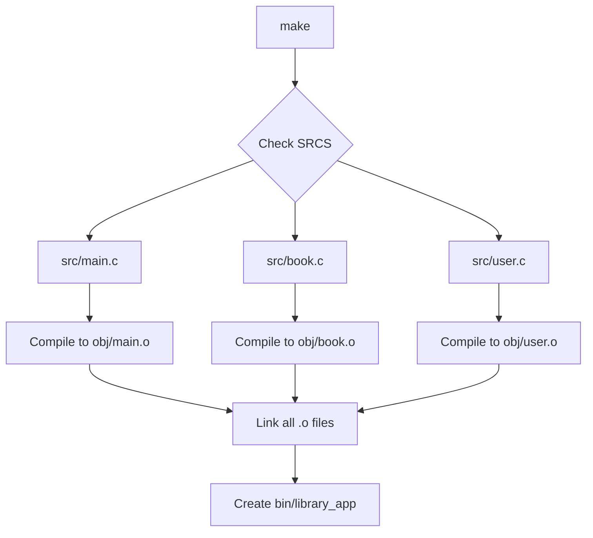

# Hướng Dẫn Viết Makefile Từng Bước

## Mục Đích

Tạo file `Makefile` để tự động hóa quá trình compile, clean, và run chương trình quản lý thư viện.

---

## Makefile Là Gì?

**Makefile** là file chứa các quy tắc (rules) để:
- ✅ **Compile** code tự động
- ✅ **Quản lý dependencies** (file nào phụ thuộc file nào)
- ✅ **Chỉ compile file đã thay đổi** (tiết kiệm thời gian)
- ✅ **Clean** build artifacts
- ✅ **Run** chương trình

**Lợi ích:**
- Không cần gõ lệnh `gcc` dài dòng mỗi lần
- Tự động phát hiện file nào cần compile lại
- Dễ quản lý dự án lớn với nhiều file

---

## Bước 1: Tạo File Makefile

```bash
cd /home/minhtri/Working_space/C_ADVANCED/BUOI_1/QUAN_LY_THU_VIEN_1
touch Makefile
```

**Lưu ý:** Tên file phải là `Makefile` (chữ M viết hoa), không có extension.

---

## Bước 2: Mở File Để Chỉnh Sửa

```bash
nano Makefile
# Hoặc
code Makefile
# Hoặc
vim Makefile
```

---

## Bước 3: Viết Nội Dung Makefile

### **Phần 1: Compiler và Flags**

Gõ vào file:

```makefile
# Compiler and flags
CC = gcc
CFLAGS = -Wall -Wextra -Werror -std=c11 -I./include
LDFLAGS = 
```

**Giải thích:**

| Biến | Ý Nghĩa | Giá Trị |
|------|---------|---------|
| `CC` | Compiler | `gcc` |
| `CFLAGS` | Compiler flags | Các tùy chọn compile |
| `LDFLAGS` | Linker flags | Để trống (chưa dùng library ngoài) |

**Chi tiết CFLAGS:**

| Flag | Ý Nghĩa |
|------|---------|
| `-Wall` | Bật tất cả warnings cơ bản |
| `-Wextra` | Bật thêm warnings nâng cao |
| `-Werror` | Treat warnings as errors (bắt buộc sửa warning) |
| `-std=c11` | Sử dụng C11 standard |
| `-I./include` | Thêm thư mục `include/` vào search path |

**Tại sao cần `-I./include`?**
- Khi code viết `#include "common.h"`, compiler sẽ tìm trong `./include/`
- Không cần viết `#include "include/common.h"`

---

### **Phần 2: Directories**

Gõ tiếp:

```makefile

# Directories
SRC_DIR = src
INC_DIR = include
OBJ_DIR = obj
BIN_DIR = bin
DATA_DIR = data
```

**Giải thích:**
- Định nghĩa các thư mục dưới dạng biến
- Dễ thay đổi sau này (chỉ sửa 1 chỗ)

---

### **Phần 3: Target và Source Files**

Gõ tiếp:

```makefile

# Target executable
TARGET = $(BIN_DIR)/library_app

# Source files (will add later when we create .c files)
SRCS = $(wildcard $(SRC_DIR)/*.c)
OBJS = $(SRCS:$(SRC_DIR)/%.c=$(OBJ_DIR)/%.o)
```

**Giải thích từng dòng:**

#### **Dòng 1: `TARGET = $(BIN_DIR)/library_app`**
- File thực thi cuối cùng: `bin/library_app`
- `$(BIN_DIR)` = `bin`

#### **Dòng 2: `SRCS = $(wildcard $(SRC_DIR)/*.c)`**
- `wildcard` - Tìm tất cả file `.c` trong `src/`
- Ví dụ: `src/main.c src/book.c src/user.c`

#### **Dòng 3: `OBJS = $(SRCS:$(SRC_DIR)/%.c=$(OBJ_DIR)/%.o)`**
- **Pattern substitution** - Chuyển `.c` thành `.o`
- `src/main.c` → `obj/main.o`
- `src/book.c` → `obj/book.o`

**Ví dụ:**
```makefile
# Nếu có 3 file .c:
SRCS = src/main.c src/book.c src/user.c

# Thì OBJS sẽ là:
OBJS = obj/main.o obj/book.o obj/user.o
```

---

### **Phần 4: Default Target**

Gõ tiếp:

```makefile

# Default target
all: $(TARGET)
```

**Giải thích:**
- `all` - Target mặc định
- Khi chạy `make` (không có tham số) → chạy `make all`
- `all` phụ thuộc vào `$(TARGET)` (bin/library_app)

---

### **Phần 5: Link Object Files**

Gõ tiếp:

```makefile

# Link object files to create executable
$(TARGET): $(OBJS) | $(BIN_DIR)
	$(CC) $(LDFLAGS) -o $@ $^
	@echo "✅ Build successful! Executable: $(TARGET)"
```

**⚠️ QUAN TRỌNG:** Dòng lệnh (`$(CC)...` và `@echo...`) phải bắt đầu bằng **TAB**, không phải spaces!

**Giải thích từng phần:**

| Phần | Ý Nghĩa |
|------|---------|
| `$(TARGET):` | Target cần tạo (bin/library_app) |
| `$(OBJS)` | Dependencies (cần có .o files trước) |
| `\| $(BIN_DIR)` | Order-only prerequisite (tạo thư mục bin/ nếu chưa có) |
| `$(CC)` | Compiler (gcc) |
| `$(LDFLAGS)` | Linker flags |
| `-o $@` | Output file = `$(TARGET)` |
| `$^` | Tất cả dependencies (tất cả .o files) |
| `@echo` | In thông báo (@ = không hiển thị lệnh) |

**Biến đặc biệt:**

| Biến | Ý Nghĩa | Ví Dụ |
|------|---------|-------|
| `$@` | Target hiện tại | `bin/library_app` |
| `$^` | Tất cả dependencies | `obj/main.o obj/book.o` |
| `$<` | Dependency đầu tiên | `obj/main.o` |

**Lệnh thực tế sẽ chạy:**
```bash
gcc -o bin/library_app obj/main.o obj/book.o obj/user.o
```

---

### **Phần 6: Compile Source Files**

Gõ tiếp:

```makefile

# Compile source files to object files
$(OBJ_DIR)/%.o: $(SRC_DIR)/%.c | $(OBJ_DIR)
	$(CC) $(CFLAGS) -c -o $@ $<
```

**Giải thích:**

#### **Pattern Rule**
- `%.o` - Bất kỳ file `.o` nào
- `%.c` - File `.c` tương ứng
- `%` - Wildcard (placeholder)

**Ví dụ:**
- `obj/main.o` cần `src/main.c`
- `obj/book.o` cần `src/book.c`

#### **Lệnh compile**
- `$(CC)` = `gcc`
- `$(CFLAGS)` = `-Wall -Wextra -Werror -std=c11 -I./include`
- `-c` = Compile only (không link)
- `-o $@` = Output file (obj/main.o)
- `$<` = Input file (src/main.c)

**Lệnh thực tế:**
```bash
gcc -Wall -Wextra -Werror -std=c11 -I./include -c -o obj/main.o src/main.c
```

---

### **Phần 7: Create Directories**

Gõ tiếp:

```makefile

# Create directories if they don't exist
$(BIN_DIR) $(OBJ_DIR):
	mkdir -p $@
```

**Giải thích:**
- Tạo thư mục `bin/` và `obj/` nếu chưa có
- `mkdir -p` - Không báo lỗi nếu thư mục đã tồn tại
- `$@` - Target hiện tại (bin hoặc obj)

---

### **Phần 8: Clean Target**

Gõ tiếp:

```makefile

# Clean build artifacts
clean:
	rm -rf $(OBJ_DIR) $(BIN_DIR)
	@echo "🧹 Cleaned build artifacts"
```

**Giải thích:**
- Xóa thư mục `obj/` và `bin/`
- `rm -rf` - Xóa đệ quy, force (không hỏi)

**Sử dụng:**
```bash
make clean
```

---

### **Phần 9: Run Target**

Gõ tiếp:

```makefile

# Run the program
run: $(TARGET)
	./$(TARGET)
```

**Giải thích:**
- `run` phụ thuộc vào `$(TARGET)`
- Nếu chưa build → build trước
- Sau đó chạy `./bin/library_app`

**Sử dụng:**
```bash
make run
```

---

### **Phần 10: Rebuild Target**

Gõ tiếp:

```makefile

# Rebuild everything
rebuild: clean all
```

**Giải thích:**
- Chạy `clean` trước (xóa build cũ)
- Sau đó chạy `all` (build lại từ đầu)

**Sử dụng:**
```bash
make rebuild
```

---

### **Phần 11: Help Target**

Gõ tiếp:

```makefile

# Help
help:
	@echo "Available targets:"
	@echo "  all     - Build the project (default)"
	@echo "  clean   - Remove build artifacts"
	@echo "  run     - Build and run the program"
	@echo "  rebuild - Clean and build"
	@echo "  help    - Show this help message"
```

**Sử dụng:**
```bash
make help
```

---

### **Phần 12: Phony Targets**

Gõ tiếp (cuối file):

```makefile

.PHONY: all clean run rebuild help
```

**Giải thích:**
- `.PHONY` - Báo cho Make biết đây không phải file thật
- Tránh conflict nếu có file tên `clean`, `run`, etc.

**Ví dụ vấn đề nếu không có `.PHONY`:**
```bash
# Nếu có file tên "clean" trong thư mục
touch clean

# Make sẽ nghĩ "clean" đã tồn tại, không chạy target
make clean  # Không làm gì!
```

---

## Makefile Hoàn Chỉnh

```makefile
# Compiler and flags
CC = gcc
CFLAGS = -Wall -Wextra -Werror -std=c11 -I./include
LDFLAGS = 

# Directories
SRC_DIR = src
INC_DIR = include
OBJ_DIR = obj
BIN_DIR = bin
DATA_DIR = data

# Target executable
TARGET = $(BIN_DIR)/library_app

# Source files (will add later when we create .c files)
SRCS = $(wildcard $(SRC_DIR)/*.c)
OBJS = $(SRCS:$(SRC_DIR)/%.c=$(OBJ_DIR)/%.o)

# Default target
all: $(TARGET)

# Link object files to create executable
$(TARGET): $(OBJS) | $(BIN_DIR)
	$(CC) $(LDFLAGS) -o $@ $^
	@echo "✅ Build successful! Executable: $(TARGET)"

# Compile source files to object files
$(OBJ_DIR)/%.o: $(SRC_DIR)/%.c | $(OBJ_DIR)
	$(CC) $(CFLAGS) -c -o $@ $<

# Create directories if they don't exist
$(BIN_DIR) $(OBJ_DIR):
	mkdir -p $@

# Clean build artifacts
clean:
	rm -rf $(OBJ_DIR) $(BIN_DIR)
	@echo "🧹 Cleaned build artifacts"

# Run the program
run: $(TARGET)
	./$(TARGET)

# Rebuild everything
rebuild: clean all

# Help
help:
	@echo "Available targets:"
	@echo "  all     - Build the project (default)"
	@echo "  clean   - Remove build artifacts"
	@echo "  run     - Build and run the program"
	@echo "  rebuild - Clean and build"
	@echo "  help    - Show this help message"

.PHONY: all clean run rebuild help
```

---

## Lưu Ý Cực Kỳ Quan Trọng

### **⚠️ TAB vs SPACES**

**Trong Makefile, các dòng lệnh PHẢI bắt đầu bằng TAB, KHÔNG PHẢI SPACES!**

```makefile
# ✅ ĐÚNG (dùng TAB)
clean:
	rm -rf $(OBJ_DIR)

# ❌ SAI (dùng spaces)
clean:
    rm -rf $(OBJ_DIR)
```

**Nếu dùng spaces, Make sẽ báo lỗi:**
```
Makefile:XX: *** missing separator. Stop.
```

**Cách kiểm tra:**
- Trong `nano`: TAB hiển thị như khoảng trắng bình thường
- Trong `vim`: `:set list` để xem TAB (`^I`)
- Trong VSCode: Bật "Render Whitespace"

**Cách sửa:**
- Xóa spaces
- Nhấn phím `Tab` (không phải spacebar nhiều lần)

---

## Workflow Build Process



**Các bước Make thực hiện:**

1. **Đọc Makefile** - Parse rules và dependencies
2. **Check dependencies** - File nào cần compile?
3. **Compile .c → .o** - Chỉ compile file đã thay đổi
4. **Link .o → executable** - Tạo file thực thi
5. **Done!**

---

## Các Lệnh Sử Dụng

### **1. Build dự án**

```bash
make
# Hoặc
make all
```

**Output:**
```
gcc -Wall -Wextra -Werror -std=c11 -I./include -c -o obj/main.o src/main.c
gcc -Wall -Wextra -Werror -std=c11 -I./include -c -o obj/book.o src/book.c
gcc -o bin/library_app obj/main.o obj/book.o
✅ Build successful! Executable: bin/library_app
```

---

### **2. Clean build artifacts**

```bash
make clean
```

**Output:**
```
rm -rf obj bin
🧹 Cleaned build artifacts
```

---

### **3. Build và chạy**

```bash
make run
```

**Tương đương:**
```bash
make
./bin/library_app
```

---

### **4. Rebuild từ đầu**

```bash
make rebuild
```

**Tương đương:**
```bash
make clean
make all
```

---

### **5. Xem help**

```bash
make help
```

**Output:**
```
Available targets:
  all     - Build the project (default)
  clean   - Remove build artifacts
  run     - Build and run the program
  rebuild - Clean and build
  help    - Show this help message
```

---

## Test Makefile

### **Test 1: Xem help**

```bash
make help
```

Nên hiển thị danh sách targets.

---

### **Test 2: Clean**

```bash
make clean
```

Nên xóa `obj/` và `bin/` (nếu có).

---

### **Test 3: Build (sẽ lỗi vì chưa có .c files)**

```bash
make
```

**Output mong đợi:**
```
make: *** No rule to make target 'obj/main.o', needed by 'bin/library_app'. Stop.
```

**Đây là bình thường!** Vì chưa có file `.c` nào trong `src/`.

---

## Kiểm Tra Syntax

```bash
# Kiểm tra Makefile có lỗi syntax không
make -n
```

**Tùy chọn:**
- `-n` - Dry run (chỉ hiển thị lệnh, không chạy)
- `-d` - Debug mode (hiển thị chi tiết)

---

## Câu Hỏi Thường Gặp

### **Q: Tại sao cần Makefile?**
A: Tự động hóa compile, chỉ compile file đã thay đổi, dễ quản lý dự án lớn.

### **Q: Có thể dùng IDE thay vì Makefile không?**
A: Được, nhưng Makefile portable hơn, chạy được trên mọi hệ thống có `make`.

### **Q: Tại sao phải dùng TAB?**
A: Quy định của Make từ năm 1976, không thể thay đổi.

### **Q: `wildcard` là gì?**
A: Tìm tất cả file khớp với pattern. VD: `$(wildcard src/*.c)` → tất cả .c trong src/

### **Q: `$@`, `$^`, `$<` là gì?**
A: Biến tự động (automatic variables):
- `$@` - Target hiện tại
- `$^` - Tất cả dependencies
- `$<` - Dependency đầu tiên

### **Q: `.PHONY` là gì?**
A: Báo cho Make biết target không phải file thật.

### **Q: Làm sao biết file nào được compile?**
A: Chạy `make -n` để xem lệnh sẽ chạy (dry run).

---

## Checklist Hoàn Thành

- [ ] Tạo file `Makefile`
- [ ] Viết phần Compiler và Flags
- [ ] Viết phần Directories
- [ ] Viết phần Target và Source Files
- [ ] Viết Default target (`all`)
- [ ] Viết Link target
- [ ] Viết Compile pattern rule
- [ ] Viết Create directories target
- [ ] Viết Clean target
- [ ] Viết Run target
- [ ] Viết Rebuild target
- [ ] Viết Help target
- [ ] Viết `.PHONY`
- [ ] Kiểm tra TAB (không phải spaces)
- [ ] Test `make help`
- [ ] Test `make clean`
- [ ] Lưu file

---

## Tiếp Theo

Sau khi hoàn thành Makefile, bạn có thể:

1. **Tạo README.md** - Hoàn thành Giai đoạn 1
2. **Chuyển sang Giai đoạn 2** - Bắt đầu code module Utils

---

## Tài Liệu Tham Khảo

- [GNU Make Manual](https://www.gnu.org/software/make/manual/)
- [Makefile Tutorial](https://makefiletutorial.com/)
- [Make for Beginners](https://opensource.com/article/18/8/what-how-makefile)

---

Chúc bạn thành công! 🚀
