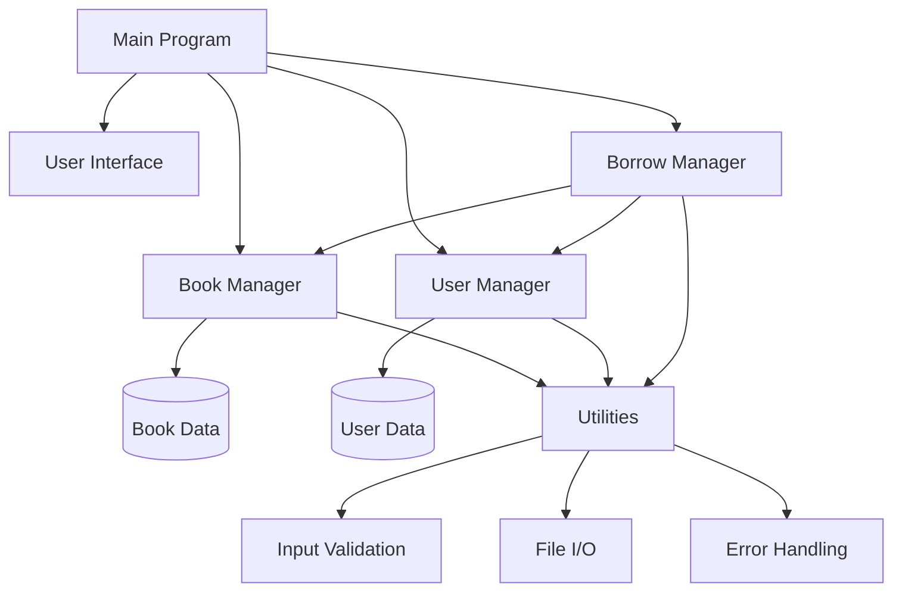

# Kế Hoạch Xây Dựng Ứng Dụng Quản Lý Thư Viện

## Phân Tích Bài Toán

Ứng dụng quản lý thư viện cần có 4 chức năng chính:
1. **Quản lý sách**: Thêm, sửa, xóa, tìm kiếm sách
2. **Quản lý người dùng**: Thêm, sửa, xóa người dùng
3. **Quản lý mượn/trả**: Theo dõi việc mượn và trả sách
4. **Xử lý lỗi**: Validate dữ liệu và xử lý các trường hợp ngoại lệ

## Kiến Trúc Hệ Thống



## Cấu Trúc Dữ Liệu

### 1. Book Structure
```c
typedef struct {
    int id;
    char title[100];
    char author[50];
    bool is_borrowed;
} Book;
```

### 2. User Structure
```c
typedef struct {
    int id;
    char name[50];
    int borrowed_books[MAX_BORROWED];  // Mảng chứa ID sách đã mượn
    int borrowed_count;
} User;
```

### 3. Library Structure (Quản lý tổng thể)
```c
typedef struct {
    Book books[MAX_BOOKS];
    int book_count;
    User users[MAX_USERS];
    int user_count;
} Library;
```

## Kế Hoạch Triển Khai (Roadmap)

### **Giai đoạn 1: Thiết lập cấu trúc dự án** ⏱️ 30 phút

#### Bước 1.1: Tạo cấu trúc thư mục
```
library_management/
├── src/
│   ├── main.c
│   ├── book.c
│   ├── user.c
│   ├── borrow.c
│   ├── ui.c
│   └── utils.c
├── include/
│   ├── book.h
│   ├── user.h
│   ├── borrow.h
│   ├── ui.h
│   ├── utils.h
│   └── common.h
├── data/
│   ├── books.txt
│   └── users.txt
├── Makefile
└── README.md
```

#### Bước 1.2: Tạo file header chung (common.h)
- Định nghĩa các constants: `MAX_BOOKS`, `MAX_USERS`, `MAX_BORROWED`
- Định nghĩa các error codes
- Include các thư viện chuẩn cần thiết

---

### **Giai đoạn 2: Xây dựng module Utilities** ⏱️ 1 giờ

#### Bước 2.1: Tạo utils.h và utils.c
Chức năng cần có:
- `validate_string()`: Kiểm tra chuỗi hợp lệ (không rỗng, không chứa ký tự đặc biệt)
- `validate_id()`: Kiểm tra ID hợp lệ (> 0)
- `trim_string()`: Loại bỏ khoảng trắng đầu/cuối
- `safe_string_copy()`: Copy chuỗi an toàn
- `get_integer_input()`: Nhập số nguyên với validation
- `get_string_input()`: Nhập chuỗi với validation
- `clear_input_buffer()`: Xóa buffer đầu vào

#### Bước 2.2: Tạo error handling
- `print_error()`: In thông báo lỗi
- `log_error()`: Ghi log lỗi (optional)

---

### **Giai đoạn 3: Xây dựng module Book** ⏱️ 2 giờ

#### Bước 3.1: Tạo book.h
Định nghĩa:
- Struct `Book`
- Các hàm CRUD cho sách

#### Bước 3.2: Tạo book.c
Implement các hàm:
- `init_book()`: Khởi tạo sách mới
- `add_book()`: Thêm sách vào thư viện
- `update_book()`: Cập nhật thông tin sách
- `delete_book()`: Xóa sách khỏi thư viện
- `find_book_by_id()`: Tìm sách theo ID
- `search_books_by_title()`: Tìm sách theo tiêu đề
- `search_books_by_author()`: Tìm sách theo tác giả
- `display_book()`: Hiển thị thông tin 1 sách
- `display_all_books()`: Hiển thị tất cả sách
- `display_available_books()`: Hiển thị sách có sẵn

#### Bước 3.3: Xử lý lỗi
- Kiểm tra ID trùng lặp
- Kiểm tra thư viện đầy
- Validate dữ liệu đầu vào

---

### **Giai đoạn 4: Xây dựng module User** ⏱️ 1.5 giờ

#### Bước 4.1: Tạo user.h
Định nghĩa:
- Struct `User`
- Các hàm CRUD cho người dùng

#### Bước 4.2: Tạo user.c
Implement các hàm:
- `init_user()`: Khởi tạo người dùng mới
- `add_user()`: Thêm người dùng
- `update_user()`: Cập nhật thông tin người dùng
- `delete_user()`: Xóa người dùng
- `find_user_by_id()`: Tìm người dùng theo ID
- `display_user()`: Hiển thị thông tin người dùng
- `display_all_users()`: Hiển thị tất cả người dùng
- `display_user_borrowed_books()`: Hiển thị sách đã mượn

#### Bước 4.3: Xử lý lỗi
- Kiểm tra ID trùng lặp
- Kiểm tra danh sách người dùng đầy
- Validate dữ liệu đầu vào

---

### **Giai đoạn 5: Xây dựng module Borrow Management** ⏱️ 2 giờ

#### Bước 5.1: Tạo borrow.h
Định nghĩa các hàm quản lý mượn/trả

#### Bước 5.2: Tạo borrow.c
Implement các hàm:
- `borrow_book()`: Mượn sách
  - Kiểm tra sách có tồn tại không
  - Kiểm tra sách có sẵn không (is_borrowed = false)
  - Kiểm tra người dùng có tồn tại không
  - Kiểm tra người dùng đã mượn tối đa chưa
  - Cập nhật trạng thái sách
  - Thêm ID sách vào danh sách mượn của người dùng
  
- `return_book()`: Trả sách
  - Kiểm tra sách có tồn tại không
  - Kiểm tra người dùng có mượn sách này không
  - Cập nhật trạng thái sách
  - Xóa ID sách khỏi danh sách mượn của người dùng

- `check_book_availability()`: Kiểm tra sách có sẵn không
- `get_borrowed_count()`: Lấy số sách đã mượn của người dùng

#### Bước 5.3: Xử lý lỗi
- Sách không tồn tại
- Sách đã được mượn
- Người dùng không tồn tại
- Người dùng đã mượn tối đa
- Người dùng không mượn sách này

---

### **Giai đoạn 6: Xây dựng User Interface** ⏱️ 2 giờ

#### Bước 6.1: Tạo ui.h và ui.c
Implement các hàm:
- `display_main_menu()`: Menu chính
- `display_book_menu()`: Menu quản lý sách
- `display_user_menu()`: Menu quản lý người dùng
- `display_borrow_menu()`: Menu quản lý mượn/trả
- `clear_screen()`: Xóa màn hình
- `pause_screen()`: Tạm dừng màn hình

#### Bước 6.2: Thiết kế menu
```
=== QUẢN LÝ THƯ VIỆN ===
1. Quản lý sách
2. Quản lý người dùng
3. Quản lý mượn/trả
4. Tìm kiếm
5. Thoát
```

---

### **Giai đoạn 7: Xây dựng File I/O (Optional)** ⏱️ 1.5 giờ

#### Bước 7.1: Thêm vào utils.c
- `save_books_to_file()`: Lưu danh sách sách ra file
- `load_books_from_file()`: Đọc danh sách sách từ file
- `save_users_to_file()`: Lưu danh sách người dùng ra file
- `load_users_from_file()`: Đọc danh sách người dùng từ file

#### Bước 7.2: Format file dữ liệu
```
books.txt:
ID|Title|Author|IsBorrowed
1|Clean Code|Robert Martin|0
2|The C Programming Language|K&R|1

users.txt:
ID|Name|BorrowedBooks|BorrowedCount
1|Nguyen Van A|2,5,7|3
2|Tran Thi B||0
```

---

### **Giai đoạn 8: Xây dựng Main Program** ⏱️ 1 giờ

#### Bước 8.1: Tạo main.c
- Khởi tạo Library
- Load dữ liệu từ file (nếu có)
- Vòng lặp menu chính
- Xử lý lựa chọn người dùng
- Lưu dữ liệu trước khi thoát

---

### **Giai đoạn 9: Testing & Debugging** ⏱️ 2 giờ

#### Bước 9.1: Test từng module
- Test module Book
- Test module User
- Test module Borrow
- Test module Utils

#### Bước 9.2: Test tích hợp
- Test luồng mượn sách hoàn chỉnh
- Test luồng trả sách
- Test các trường hợp lỗi

#### Bước 9.3: Test edge cases
- Thư viện rỗng
- Thư viện đầy
- Người dùng mượn tối đa
- Dữ liệu không hợp lệ

---

### **Giai đoạn 10: Tối ưu & Clean Code** ⏱️ 1 giờ

#### Bước 10.1: Code review
- Kiểm tra naming convention
- Kiểm tra indentation
- Kiểm tra comments
- Kiểm tra magic numbers

#### Bước 10.2: Refactoring
- Tách các hàm quá dài
- Loại bỏ code trùng lặp
- Tối ưu logic

#### Bước 10.3: Documentation
- Viết README.md
- Comment các hàm phức tạp
- Tạo user manual

---

## Clean Code Principles Cần Tuân Thủ

### 1. Naming Convention
- **Functions**: `snake_case` - VD: `add_book()`, `find_user_by_id()`
- **Variables**: `snake_case` - VD: `book_count`, `user_id`
- **Constants**: `UPPER_SNAKE_CASE` - VD: `MAX_BOOKS`, `MAX_USERS`
- **Structs**: `PascalCase` - VD: `Book`, `User`, `Library`

### 2. Function Design
- Mỗi hàm chỉ làm một việc
- Tên hàm phải mô tả rõ chức năng
- Tham số không quá 3-4 tham số
- Return code để báo lỗi (0 = success, -1 = error)

### 3. Error Handling
```c
typedef enum {
    SUCCESS = 0,
    ERROR_INVALID_INPUT = -1,
    ERROR_NOT_FOUND = -2,
    ERROR_ALREADY_EXISTS = -3,
    ERROR_FULL = -4,
    ERROR_BOOK_BORROWED = -5,
    ERROR_BOOK_NOT_BORROWED = -6
} ErrorCode;
```

### 4. Code Organization
- Mỗi module một file .c và .h
- Header guards trong tất cả file .h
- Include order: system headers → local headers
- Không có global variables (trừ constants)

### 5. Comments
- Comment giải thích "tại sao", không phải "cái gì"
- Function header comments mô tả: mục đích, tham số, return value
- Inline comments cho logic phức tạp

### 6. Memory Management
- Luôn check NULL pointer
- Free memory khi không dùng (nếu dùng dynamic allocation)
- Tránh memory leak

---

## Makefile Mẫu

```makefile
CC = gcc
CFLAGS = -Wall -Wextra -Werror -std=c11 -I./include
LDFLAGS = 

SRC_DIR = src
INC_DIR = include
OBJ_DIR = obj
BIN_DIR = bin

TARGET = $(BIN_DIR)/library_app

SRCS = $(wildcard $(SRC_DIR)/*.c)
OBJS = $(SRCS:$(SRC_DIR)/%.c=$(OBJ_DIR)/%.o)

all: $(TARGET)

$(TARGET): $(OBJS) | $(BIN_DIR)
	$(CC) $(LDFLAGS) -o $@ $^

$(OBJ_DIR)/%.o: $(SRC_DIR)/%.c | $(OBJ_DIR)
	$(CC) $(CFLAGS) -c -o $@ $<

$(BIN_DIR) $(OBJ_DIR):
	mkdir -p $@

clean:
	rm -rf $(OBJ_DIR) $(BIN_DIR)

run: $(TARGET)
	./$(TARGET)

.PHONY: all clean run
```

---

## Checklist Hoàn Thành

### Cấu trúc dự án
- [ ] Tạo cấu trúc thư mục
- [ ] Tạo Makefile
- [ ] Tạo common.h với constants và error codes

### Module Utils
- [ ] Implement validation functions
- [ ] Implement input functions
- [ ] Implement error handling

### Module Book
- [ ] Implement CRUD operations
- [ ] Implement search functions
- [ ] Implement display functions
- [ ] Error handling

### Module User
- [ ] Implement CRUD operations
- [ ] Implement display functions
- [ ] Error handling

### Module Borrow
- [ ] Implement borrow_book()
- [ ] Implement return_book()
- [ ] Implement helper functions
- [ ] Error handling

### Module UI
- [ ] Implement menu system
- [ ] Implement screen utilities

### File I/O (Optional)
- [ ] Implement save functions
- [ ] Implement load functions

### Main Program
- [ ] Implement main loop
- [ ] Integrate all modules

### Testing
- [ ] Unit tests
- [ ] Integration tests
- [ ] Edge case tests

### Documentation
- [ ] Code comments
- [ ] README.md
- [ ] User manual

---

## Thời Gian Ước Tính

| Giai đoạn | Thời gian |
|-----------|-----------|
| Thiết lập cấu trúc | 30 phút |
| Module Utils | 1 giờ |
| Module Book | 2 giờ |
| Module User | 1.5 giờ |
| Module Borrow | 2 giờ |
| Module UI | 2 giờ |
| File I/O | 1.5 giờ |
| Main Program | 1 giờ |
| Testing | 2 giờ |
| Clean Code | 1 giờ |
| **TỔNG** | **~14-15 giờ** |

---

## Lời Khuyên

> [!TIP]
> **Bắt đầu từ nhỏ**: Implement từng module một, test kỹ trước khi chuyển sang module tiếp theo.

> [!IMPORTANT]
> **Validation là chìa khóa**: Luôn validate input trước khi xử lý để tránh lỗi runtime.

> [!WARNING]
> **Tránh hardcode**: Sử dụng constants thay vì magic numbers.

> [!NOTE]
> **File I/O là optional**: Bạn có thể bỏ qua phần này nếu muốn tập trung vào logic chính trước.

---

## Tài Liệu Tham Khảo

1. **Clean Code in C**: Principles and practices
2. **C Coding Standards**: GNU Coding Standards, Linux Kernel Coding Style
3. **Error Handling in C**: Best practices for robust code
4. **Makefile Tutorial**: Automating C projects

Chúc bạn code thành công! 🚀
